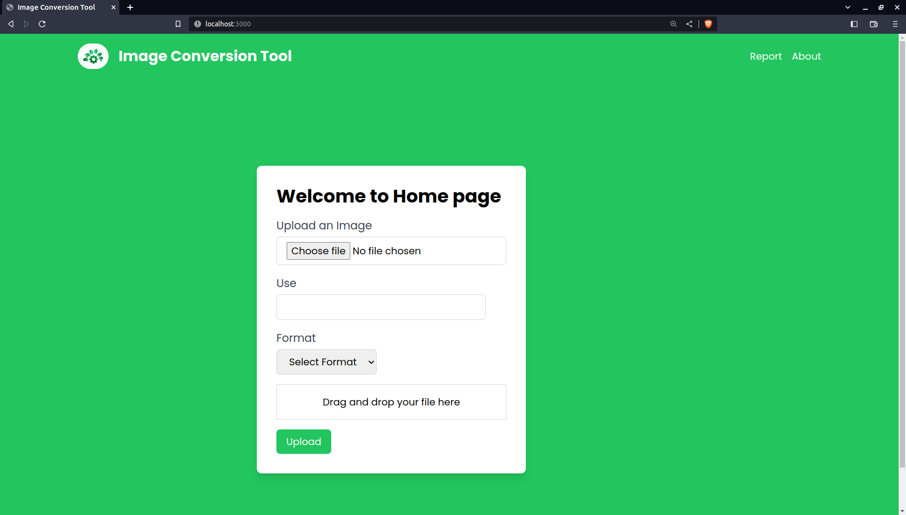
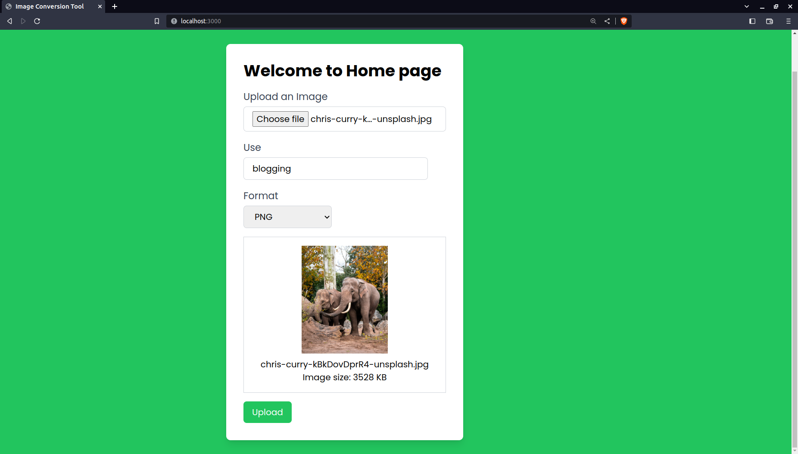
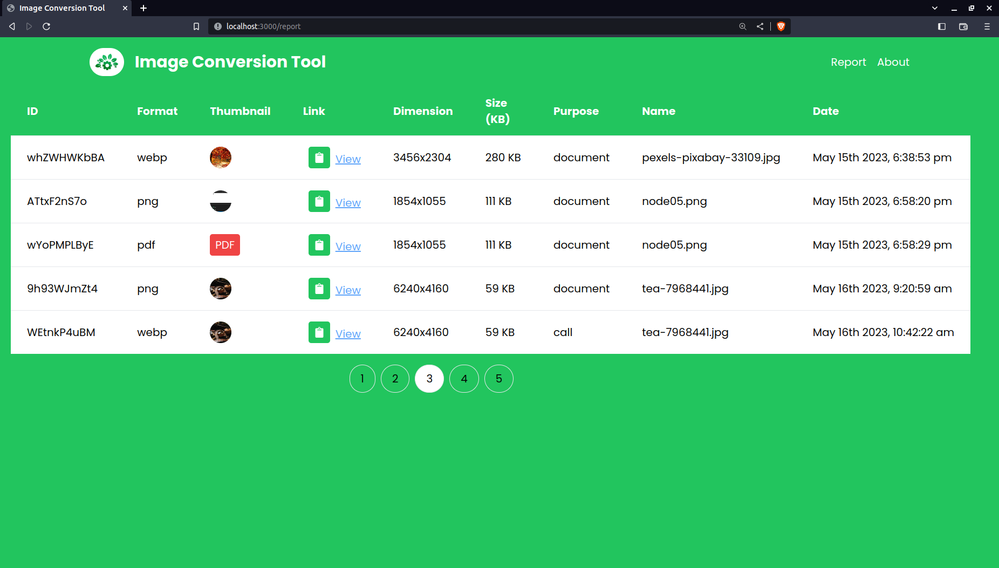

## Example Screenshots

### Step 1
- 

### Step 2
- 

### Step 3
- 

### Step 4
- 

{
  "name": "image-conversion-tool",
  "version": "0.1.0",
  "private": true,
  "scripts": {
    "dev": "next dev",
    "build": "next build",
    "start": "next start",
    "lint": "next lint"
  },
  "dependencies": {
    "@types/node": "20.1.7",
    "@types/react": "18.2.6",
    "@types/react-dom": "18.2.4",
    "autoprefixer": "10.4.14",
    "axios": "^1.4.0",
    "eslint": "8.40.0",
    "eslint-config-next": "13.4.2",
    "formidable": "^2.1.1",
    "moment": "^2.29.4",
    "next": "13.4.2",
    "postcss": "8.4.23",
    "react": "18.2.0",
    "react-dom": "18.2.0",
    "react-icons": "^4.8.0",
    "react-loader-spinner": "^5.3.4",
    "react-toastify": "^9.1.3",
    "tailwindcss": "3.3.2",
    "typescript": "5.0.4"
  },
  "devDependencies": {
    "@types/formidable": "^2.0.6"
  }
}
